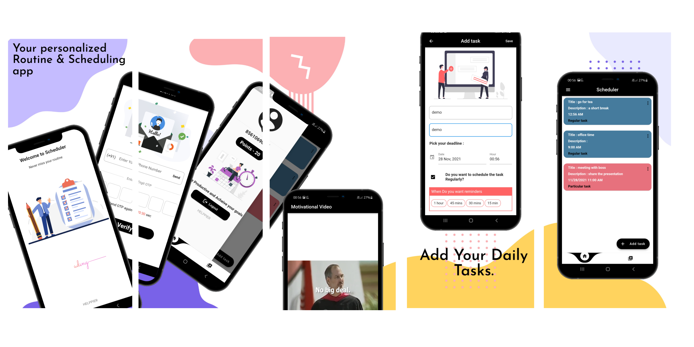

# Scheduler

Scheduler is a cross platform application written in flutter to help  people stick to their routines and achieve their goals. 

## Our service includes:

 * Helping users schedule their routines and goals with a deadline 
 * Sending push notification to keep the users aware of the goals
 * Rewarding them with in app points to encourage them to follow their routine and keep track on how good their progress is.
 * Also deducing their points if they fail to complete their task
 * We also provide with motivational videos which would boost your confidence and teach you why a routine is important.

You can download the android application using the following link:

https://drive.google.com/drive/folders/1yCVJOJJrZAUyoD68_X_8IvCnBOC7LIb-?usp=sharing

## List of features integrated during the hack:

  * Added media player for motivational videos
  * Added Firebase Cloud Messaging for push notifications
  * Added Lottie animations

These were the list of features our team got and we have integrated all three